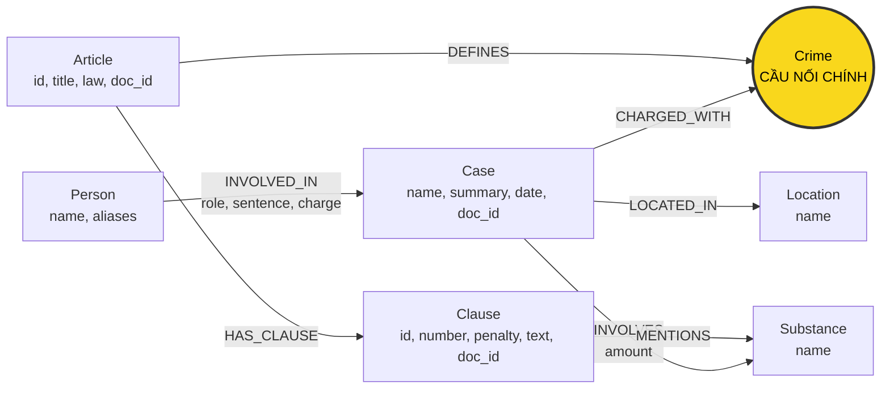

# Thiết kế Ontology — Day 19

**Họ tên:** Trần Kim Phương  **MSSV:** 2A202602565

**Lựa chọn** (đánh dấu một):
- [x] Dùng ontology gợi ý (có thể chỉnh nhỏ)
- [ ] Tự thiết kế (xét bonus +15, xem `SUBMISSION.md`)

> Hướng dẫn: `LAB_GUIDE.md` Bước 2. Dùng ontology gợi ý thì vẫn phải điền đủ các mục dưới đây bằng lời của bạn.

## 1. Sơ đồ

Giữ 7 label và 7 loại quan hệ của các hàm `HINT` trong `src/graph.py`. **Crime là node cầu nối chính** giữa KB tin tức và KB luật; `Substance` là cầu nối bổ trợ để chọn khoản có nhắc đến chất của vụ việc.

Độ chi tiết: **Điều → Khoản**. Các điểm `a)`, `b)`… nằm trong `Clause.text`, không tạo node riêng. Khung hình phạt luật nằm ở `Clause.penalty`; mức án của từng người nằm trên cạnh `INVOLVED_IN.sentence`, vì cùng một vụ có thể có nhiều người nhận án khác nhau.

## 2. Entity types (node labels)

| Label | Ý nghĩa | Khóa định danh (`MERGE` theo) | Properties | Lấy từ KB nào | Trích bằng (regex / LLM / khác) |
| --- | --- | --- | --- | --- | --- |
| `Article` | Một Điều của BLHS hoặc Luật Phòng, chống ma túy | `id`, ví dụ `Điều 251 BLHS`, `Điều 2 Luật PCMT` | `id`, `title`, `law`, `doc_id` | Luật | `parse_law_article`: metadata của tài liệu và regex; ghi bằng `add_law_article` |
| `Clause` | Một khoản trong Điều; lưu cả các điểm dưới khoản | `id`, ví dụ `Điều 251 BLHS khoản 1` | `id`, `number` (số nguyên), `penalty`, `text`, `doc_id` | Luật | Regex đầu dòng `^(\d+)\.\s`, bỏ chú thích `[n]`; lấy hình phạt ở dòng đầu khoản |
| `Crime` | Tên tội danh chuẩn, dùng chung cho hai KB | `name` đã chuẩn hóa, ví dụ `mua bán trái phép chất ma túy` | `name`, `doc_id` nếu chỉ thuộc một tài liệu | Luật tạo danh sách chuẩn; tin tham chiếu danh sách này | `normalize_crime` từ tiêu đề bắt đầu bằng `Tội `; LLM trích tội từ tin, rồi `link_entity` |
| `Case` | Một vụ việc cụ thể được bài báo mô tả | `name` do LLM đặt; nếu thiếu dùng tiêu đề bài hoặc `Document.id` | `name`, `summary`, `date`, `doc_id`, `source_title` | Tin | `extract_news_cases` qua LLM → JSON; ghi bằng `add_news_case` |
| `Person` | Người tham gia vụ việc; có thể có biệt danh | `name` (họ tên) | `name`, `aliases` (danh sách biệt danh), `doc_id` nếu chỉ thuộc một tài liệu | Tin | LLM; vai trò, tội danh và mức án lưu trên cạnh tới vụ, không trên node |
| `Substance` | Chất ma túy được nhắc trong luật hoặc liên quan đến vụ | `name`, ưu tiên tên trong `SUBSTANCES`, ví dụ `MDMA`, `Ketamine` | `name`, `doc_id` nếu chỉ thuộc một tài liệu | Cả hai KB | Luật: `find_substances` dò tên trong danh sách, không phân biệt hoa/thường; tin: LLM được cung cấp danh sách chuẩn, rồi `link_entity` với chuẩn hóa khoảng trắng đầu/cuối và `casefold` |
| `Location` | Tỉnh/thành phố của vụ việc | `name` | `name`, `doc_id` nếu chỉ thuộc một tài liệu | Tin | LLM; không tạo node nếu địa điểm rỗng |

**Khóa và nguồn gốc:** dùng `suggested_constraints()` để đặt ràng buộc duy nhất trên khóa của cả 7 label, sau đó ghi bằng `MERGE`. Khóa Điều có tên luật để không gộp hai Điều cùng số thuộc hai luật khác nhau.

`build_graph` tạo constraint, nạp toàn bộ luật bằng regex, lấy danh sách tội chuẩn, rồi gọi `llm_fn(prompt, json_mode=True)` một lần mỗi bài báo để nạp các vụ. `Article`, `Clause`, `Case` mang `doc_id = Document.id`. Sau khi nạp, một truy vấn thu thập `DISTINCT doc_id` từ các node `Article`/`Clause`/`Case` kề mỗi `Crime`/`Substance`/`Person`/`Location`: đúng một nguồn thì ghi `doc_id` của nguồn đó; nhiều nguồn thì để `doc_id` rỗng vì không có một tài liệu sở hữu duy nhất. Nhiều khoản trong cùng một Điều vẫn chỉ tính là một tài liệu. Nhờ vậy không miễn hợp đồng nguồn gốc chỉ dựa vào label; node dùng chung vẫn truy được nguồn qua các cạnh.

**Giới hạn định danh chấp nhận ở bản gợi ý:** `MERGE` chỉ gộp khi khóa giống hệt nhau. Hai bài đặt tên vụ khác nhau có thể tạo hai `Case`; hai người trùng họ tên có thể bị gộp nhầm. `aliases` giúp tìm người qua biệt danh nhưng không tự gộp hai node có `name` khác nhau. Tên địa điểm và tên chất đồng nghĩa cũng chưa được giải quyết đầy đủ. Khi hai bài bị gộp vào cùng `Case`, phép `SET` có thể ghi đè `doc_id`/tóm tắt; không coi khóa theo tên là cơ chế quản lý đa nguồn đáng tin cậy.

## 3. Relationships

| Type | Từ → Đến | Properties trên cạnh | Ý nghĩa |
| --- | --- | --- | --- |
| `DEFINES` | `Article` → `Crime` | Không | Điều luật định nghĩa tội danh; chỉ tạo khi tiêu đề Điều bắt đầu bằng `Tội ` |
| `HAS_CLAUSE` | `Article` → `Clause` | Không | Điều có các khoản, được phân biệt bằng `Clause.number` |
| `MENTIONS` | `Clause` → `Substance` | Không | Văn bản khoản nhắc tên chất; **không** khẳng định khoản đó áp dụng cho mọi vụ có chất này |
| `CHARGED_WITH` | `Case` → `Crime` | Không | Tội danh/hành vi được bài báo nêu cho vụ, đã nối về danh sách tội chuẩn; không tự khẳng định đã có bản án có hiệu lực |
| `INVOLVES` | `Case` → `Substance` | `amount` (chuỗi, ví dụ `hơn 9,6kg`, `5 viên`) | Vụ liên quan đến chất với lượng được báo nêu; chưa tách giá trị số, đơn vị hoặc lượng riêng của từng người |
| `LOCATED_IN` | `Case` → `Location` | Không | Địa điểm tỉnh/thành phố của vụ |
| `INVOLVED_IN` | `Person` → `Case` | `role`, `sentence`, `charge` (chuỗi) | Vai trò, mức án thực tế và tội danh của **người đó trong vụ đó**; trường không được nguồn nêu để rỗng |

Không tạo node `Sentence`, `Penalty` hay `Amount`: đây là thuộc tính của khoản luật hoặc của quan hệ trong một vụ cụ thể. Khi một vụ có nhiều tội, phải đọc `INVOLVED_IN.charge` để chọn tội của người đang được hỏi, không gán mọi `CHARGED_WITH` của vụ cho mọi người.

## 4. Node cầu nối giữa 2 KB

- **Node nào:** `Crime` là cầu nối chính: `(Case)-[:CHARGED_WITH]->(Crime)<-[:DEFINES]-(Article)`. `Substance` bổ trợ qua `(Case)-[:INVOLVES]->(Substance)<-[:MENTIONS]-(Clause)`; chỉ dùng để tìm ngữ cảnh về chất, không thay thế việc xác định tội danh.
- **Vì sao chọn node này:** luật đặt tên tội ở tiêu đề Điều, còn tin mô tả hành vi/tội của vụ. Người, tên vụ và địa điểm thường chỉ có trong tin nên không phù hợp làm cầu nối chính. Ví dụ: Lê Minh Thành → vụ mua bán ma túy → `mua bán trái phép chất ma túy` ← Điều 251 BLHS. Người → Điều dài 3 cạnh; người → khoản dài 4 cạnh, phù hợp giới hạn cầu nối trong `--check`.
- **Cách đảm bảo hai phía khớp tên:** tạo danh sách `known_crimes` từ các Điều có tội danh; đưa danh sách này vào `NEWS_EXTRACTION_PROMPT`. Thiết kế `link_entity` chuẩn hóa cả tên trích được lẫn danh sách chuẩn bằng `normalize_crime`: bỏ khoảng trắng thừa, dấu nháy ở đầu/cuối, chuyển thường, bỏ tiền tố `tội `. Khớp chính xác trước; nếu không, dùng `difflib.get_close_matches(..., n=1, cutoff=0.8)`, trả về cách viết gốc trong `known`, hoặc `None`. `normalize_crime` hiện **không** đổi trực tiếp `tuý` thành `túy`; các biến thể còn lại dựa vào so khớp gần đúng, có nguy cơ nối sai cần kiểm tra. `extract_news_cases` áp dụng liên kết cho cả tội của vụ và `people[].charge`.
- **Khi nào cầu gãy, và xử lý thế nào:** tội bị bỏ sót, tên khác quá xa, hoặc luật trong KB không có tội tương ứng thì không có `CHARGED_WITH` hợp lệ. Giữ vụ và dữ kiện tin, không đoán một Điều luật để nối; kiểm tra bài gốc qua `Case.doc_id`, JSON trích xuất và danh sách tội chuẩn để tìm nguyên nhân. Tên gần nhau nhưng khác hành vi cũng có thể nối nhầm, nên đối chiếu `INVOLVED_IN.charge` với nguồn. Biệt danh bị thiếu trong `Person.aliases` làm mất seed theo câu hỏi, dù cầu `Crime` có thể vẫn tồn tại; dùng chunk vector/`doc_id` và kiểm tra tên trong nguồn.
- **Giới hạn có chủ đích:** Điều giải thích từ ngữ của Luật PCMT không tạo `Crime`; truy vấn trực tiếp `Article` → `Clause` để lấy định nghĩa. Tên chất từ LLM được liên kết lại qua `link_entity` với `SUBSTANCES`, ưu tiên khớp chính xác sau `strip().casefold()`, rồi fuzzy cutoff 0.8. Không đủ giống thì giữ tên nguồn thay vì đoán một chất chuẩn. Đây không phải từ điển đồng nghĩa; không suy ra chất cụ thể chỉ từ từ lóng hay cụm “ma túy tổng hợp” khi nguồn chưa xác định.

## 5. Competency questions

Các câu dưới đây lấy từ `data/benchmark_kg.json`. Đây là **đường truy vấn thiết kế**, chưa phải kết quả chạy Neo4j hay benchmark. Khả năng trả lời phụ thuộc dữ kiện được trích đúng và được đưa đủ vào `context()`.

| Câu | Đường đi (Cypher pattern) | Trả lời được? |
| --- | --- | --- |
| Q1 — Tiền chất là gì theo Luật PCMT 2021? | `(a:Article {id:'Điều 2 Luật PCMT'})-[:HAS_CLAUSE]->(cl:Clause {number:4})`; đọc `cl.text` | **Có từ văn bản khoản.** Định nghĩa nằm ở khoản 4, không có node `Precursor` riêng. Cần tìm Điều qua chunk/`doc_id` hoặc nội dung định nghĩa, vì câu hỏi không nêu số Điều. Chỉ lấy khoản 1 theo HINT sẽ thiếu đáp án. |
| Q2 — Ai bị tử hình trong vụ hơn 36kg xét xử ngày 28-9 tại TP.HCM? | `(p:Person)-[r:INVOLVED_IN]->(k:Case {doc_id:'news-100260928173914514'})`; lọc `r.sentence` có `tử hình`, trả `DISTINCT p.name`; đối chiếu `(k)-[:LOCATED_IN]->(l:Location)` và `k.summary` | **Có nếu trích đúng mức án.** Nguồn nêu Trần Thanh Tuấn và Trần Minh Tâm. Dùng bài/summary để xác định đúng vụ; không chỉ lọc `k.date`, vì HINT có thể trích ngày xảy ra hoặc ngày xét xử vào cùng trường. |
| Q3 — Mức án, tội, Điều và khung cơ bản của Lê Minh Thành? | `(p:Person {name:'Lê Minh Thành'})-[r:INVOLVED_IN]->(k:Case)-[:CHARGED_WITH]->(c:Crime)<-[:DEFINES]-(a:Article)-[:HAS_CLAUSE]->(cl:Clause {number:1})`; chọn `c.name = r.charge` | **Có.** Đọc `r.sentence` = 36 tháng tù, `r.charge` = mua bán trái phép chất ma túy; Điều 251, khoản 1 có khung 02–07 năm. Tội của người lấy từ cạnh, không suy ra từ tội của người khác cùng vụ. |
| Q4 — Hoàng Nato bị bắt về hành vi gì, khung tối đa là gì? | `(p:Person)-[r:INVOLVED_IN]->(k:Case)-[:CHARGED_WITH]->(c:Crime)<-[:DEFINES]-(a:Article {id:'Điều 255 BLHS'})-[:HAS_CLAUSE]->(cl:Clause)`; tìm `p.name = 'Dương Minh Tuấn'` hoặc biệt danh `Hoàng Nato` trong `p.aliases`, chọn tội theo `r.charge` | **Có ở schema, không đủ với bộ lọc khoản HINT nguyên trạng.** Phải đọc các khoản hình phạt để tìm mức tối đa; khoản 4 nêu 20 năm hoặc chung thân nhưng không nhắc chất cụ thể. Đây là khung cao nhất của tội, không phải mức án đã tuyên hay kết luận khoản 4 áp dụng cho người bị bắt. |
| Q5 — Tội, chất và khoản áp dụng theo lượng MDMA của Cái Quang Huy? | `(p:Person {name:'Cái Quang Huy'})-[r:INVOLVED_IN]->(k:Case)-[v:INVOLVES]->(s:Substance {name:'MDMA'})`; cùng `k` đi `(k)-[:CHARGED_WITH]->(c:Crime)<-[:DEFINES]-(a:Article {id:'Điều 250 BLHS'})-[:HAS_CLAUSE]->(cl:Clause)-[:MENTIONS]->(s)`; chọn tội theo `r.charge`, lấy thêm các cạnh `INVOLVES` để biết Ketamine | **Có ngữ cảnh để đối chiếu; chưa tự suy luận ngưỡng bằng graph.** Hơn 9,6kg MDMA vượt 100g; đọc điểm b trong `cl.text` của khoản 4: 20 năm, chung thân hoặc tử hình. `v.amount` là chuỗi và ngưỡng nằm trong text, nên việc đổi đơn vị/chọn khoản do người đọc hoặc LLM thực hiện. `MENTIONS` một mình không đủ chứng minh khoản áp dụng; lượng trên cạnh là lượng của vụ, phải đối chiếu bài để xác nhận phần Huy chịu trách nhiệm. |
| Q6 — Những vụ nào liên quan MDMA? | `(k:Case)-[:INVOLVES]->(:Substance {name:'MDMA'})`; trả `DISTINCT k.name, k.summary, k.doc_id`; có thể lấy thêm `(p:Person)-[:INVOLVED_IN]->(k)` để nhận diện người | **Có cho dữ liệu đã trích, không bảo đảm đầy đủ nếu chỉ lấy seed/top-k.** Truy vấn tất cả vụ có cạnh MDMA, không giới hạn ở bài vector search chọn. Nguồn chuẩn nhắc vụ Cái Quang Huy, Lê Minh Thành và Viện Pháp y tâm thần Trung ương. `DISTINCT` không gộp được một vụ bị đặt nhiều tên; không coi danh sách node là số vụ ngoài đời đã khử trùng. |

**Đối chiếu nguồn:** Q1: `data/drug_law/pcmt-dieu-2.md`, khoản 4; Q2: `data/drug_news/news-100260928173914514.md`; Q3: `data/drug_news/news-100260918080821054.md` và khoản 1 Điều 251; Q4: `data/drug_news/news-100260920221957595.md` và khoản 4 Điều 255; Q5: `data/drug_news/news-100260917203001265.md` và khoản 4 Điều 250. Với Q6, MDMA được nêu rõ ở hai bài về Huy/Thành và `data/drug_news/news-100260930085028036.md` về Viện Pháp y tâm thần Trung ương. Một số bài còn có đoạn giới thiệu bài liên quan ở cuối: khi trích xuất cần tránh gán chất/vụ của đoạn đó sang vụ chính.

**Truy xuất KG-3 đã triển khai:** `context()` dùng `seed_facts` để lấy seed và cạnh 1 bước; lấy `Case` là seed hoặc kề seed, rồi đi `Case` → `Crime` ← `Article` → `Clause`. Nhánh vụ giữ khoản 1 và khoản nhắc chất mà vụ đó liên quan. Nhánh Điều được nêu bằng `[Đđ]iều (\d+)` giữ khoản 1 và khoản nhắc chất trong câu hỏi; so số Điều với tiền tố có dấu cách phía sau để không nhầm Điều 25 với Điều 251. Nếu `Article` hoặc `Clause` đã là seed từ tài liệu luật, lấy văn bản khoản tương ứng; seed `Article` lấy mọi khoản của Điều, tránh chỉ đưa tên cạnh mà thiếu định nghĩa như Q1. Khử trùng khoản bằng `UNION`/`DISTINCT`, rồi trả dòng `[Điều - tiêu đề] khoản n: văn bản`. Giới hạn tổng `max_facts` (mặc định 60), ưu tiên dòng luật, khoản 1 trước, sau đó tóm tắt vụ và cạnh seed; giá trị không dương trả `[]`. Nhánh chất làm seed có thể tới các vụ kề chất trên toàn graph, nhưng vẫn chịu giới hạn. Chưa có nhánh riêng cho khung tối đa Q4; không đánh dấu cả sáu câu đạt chỉ vì graph có đường đi.

**Phạm vi pháp luật:** các khung trên đối chiếu đúng corpus của bài tập; metadata BLHS ghi bản 2015 sửa đổi 2017. Không coi kết quả benchmark là xác nhận pháp luật đang có hiệu lực tại thời điểm sử dụng.

## 6. Quyết định thiết kế và đánh đổi

1. **Dùng `Crime` làm cầu nối chính, `Substance` làm cầu nối bổ trợ.** Chọn đường `Case` → `Crime` ← `Article` vì tên tội xuất hiện ở cả luật và tin, giúp tìm Điều tương ứng trước khi chọn khoản. Phương án khác là nối vụ thẳng tới Điều, hoặc chỉ nối qua chất. Nối thẳng đòi hỏi tin nêu đúng số Điều; nối chỉ qua chất dễ lấy cả Điều về mua bán, vận chuyển và tàng trữ dù vụ chỉ có một hành vi. Đánh đổi: phải chuẩn hóa và liên kết tội danh; nối sai `Crime` sẽ dẫn tới sai căn cứ luật.

2. **Tách luật tới cấp Điều → Khoản, giữ các điểm trong `Clause.text`.** Chọn lưu `number`, `penalty` và toàn văn khoản để vừa trả lời khung cơ bản của Q3, vừa có nội dung đối chiếu ngưỡng ở Q5. Phương án khác là chỉ tạo node Điều hoặc tạo thêm node Điểm/ngưỡng. Chỉ lưu Điều làm ngữ cảnh quá rộng; tách từng điểm chính xác hơn nhưng cần thêm label, quan hệ và quy tắc trích xuất. Đánh đổi: bản gợi ý có ít loại node và Cypher đơn giản, nhưng vẫn phải đọc text để phân biệt các điều kiện trong cùng khoản.

3. **Giữ mức án và khối lượng ở nơi chúng có ngữ cảnh.** Chọn `INVOLVED_IN` chứa `role`, `charge`, `sentence`; `INVOLVES` chứa `amount`; `Clause.penalty` chứa khung hình phạt luật. Phương án khác là đặt mức án trên `Person`/`Case`, hoặc tạo node riêng cho hình phạt và lượng chất. Thuộc tính trên cạnh tránh gán cùng một án cho mọi bị cáo và cho phép một người tham gia nhiều vụ. Đánh đổi: các giá trị còn là chuỗi; một cạnh người–vụ không biểu diễn được đầy đủ nhiều tội/mức án theo từng giai đoạn, còn lượng chất cấp vụ không thể tự gán cho từng người.

4. **Dùng regex cho luật, LLM cho tin và danh sách tội chuẩn để liên kết.** Chọn `parse_law_article` cho cấu trúc đánh số đều của luật; dùng `extract_news_cases` cho cách diễn đạt linh hoạt của báo. Phương án khác là dùng LLM cho cả hai KB hoặc regex cho toàn bộ tin. Regex luật không cần chi phí gọi model và cho kết quả xác định với cùng đầu vào; LLM phù hợp hơn để nhận diện người, biệt danh, hành vi và mức án trong tin. Đánh đổi: regex phụ thuộc định dạng, còn trích tin phụ thuộc model và có thể bỏ sót/sai dữ kiện. Danh sách chuẩn trong prompt không thay thế bước `link_entity`; nếu không khớp đủ thì không nối, thay vì đoán tội.

5. **Giữ khóa và ràng buộc duy nhất theo HINT.** Chọn `id` cho `Article`/`Clause`, `name` cho các label còn lại, kèm `MERGE` và uniqueness constraint. Phương án khác là định danh vụ/người bằng mã ổn định và đối chiếu nhiều thuộc tính, hoặc tách mỗi lần xuất hiện trong tài liệu thành node riêng. Giữ khóa gợi ý giúp tái sử dụng các hàm ghi có sẵn và tập trung trước vào đường đi xuyên hai KB. Đánh đổi: constraint chỉ bảo đảm khóa không trùng, không chứng minh thực thể ngoài đời là một; tên vụ khác nhau có thể tạo bản sao, người trùng tên có thể bị gộp nhầm. Đây là giới hạn chấp nhận cho bài tập, không phải thiết kế định danh phù hợp cho hệ thống thực tế.

6. **Giữ `amount` và ngưỡng trong văn bản, chưa xây bộ suy luận pháp lý.** Chọn lượng chất dạng chuỗi theo nguồn và điều kiện áp dụng trong `Clause.text`, để không tự chuyển “5 viên” thành gam hoặc bỏ mất ý nghĩa “hơn”, “gần”. Phương án khác là chuẩn hóa lượng thành số/đơn vị, mô hình hóa ngưỡng và xét khoản bằng Cypher. Phương án đó cho phép kiểm tra điều kiện có cấu trúc nhưng phải xử lý đơn vị, khoảng lượng, nhiều chất và lượng từng bị cáo. Đánh đổi: Q5 có đủ ngữ cảnh để đối chiếu MDMA với khoản 4 Điều 250, nhưng graph không tự chứng minh khoản áp dụng; kết luận cần kiểm tra với văn bản và dữ kiện nguồn.

7. **Chọn ngữ cảnh theo nhu cầu câu hỏi, không coi lọc cùng chất là quy tắc áp dụng luật.** KG-3 giữ khoản 1 và các khoản nhắc chất cho nhánh vụ; seed luật đưa văn bản các khoản, hỗ trợ định nghĩa như Q1. Phương án khác là luôn lấy mọi khoản/mọi vụ, hoặc luôn dùng đúng bộ lọc HINT. Lấy tất cả tăng độ dài prompt và chi phí; lọc theo chất có thể thiếu khung tối đa Q4 khi khoản nặng nhất không có `MENTIONS`. Đánh đổi: ưu tiên luật trong giới hạn `max_facts` giúp tránh mất toàn bộ căn cứ luật khi có nhiều cạnh seed, nhưng có thể cắt bớt tóm tắt hoặc mức án; chưa có nhánh riêng cho câu hỏi khung tối đa.

## 7. So với ontology gợi ý (bắt buộc nếu xét bonus)

| Điểm khác | Gợi ý làm gì | Bạn làm gì | Vấn đề nó giải quyết | Bằng chứng (Cypher, hoặc số liệu benchmark) |
| --- | --- | --- | --- | --- |
| | | | | |

## 8. Hạn chế còn lại

Các mục dưới đây là **hạn chế của thiết kế và các hàm HINT đã đọc**, không phải lỗi đã được chứng minh bằng chạy benchmark. Khi triển khai, cần ghi Cypher/kết quả hoặc câu trả lời thực tế để xác nhận mức ảnh hưởng.

1. **Định danh và khử trùng chưa chắc chắn.** Khóa theo tên không xử lý được hai cách gọi cùng vụ/người, hoặc hai người trùng tên. `aliases` hỗ trợ tìm kiếm nhưng không tự hợp nhất node. Q6 có thể liệt kê trùng vụ; `DISTINCT` chỉ loại hàng trùng trong kết quả, không giải quyết định danh ngoài đời.

2. **Nguồn gốc đa tài liệu chưa được mô hình hóa đầy đủ.** Node chỉ thuộc một tài liệu được gắn `doc_id`; node dùng chung được nhận diện qua các cạnh tới node có nguồn, nhưng không có nguồn ở cấp cạnh/dữ kiện. Khi nhiều bài được gộp vào một `Case`, `SET` có thể ghi đè nguồn, tóm tắt và ngày; aliases của người và thuộc tính trên các cạnh cũng có thể bị cập nhật bởi bài sau. Một giá trị `doc_id` không lưu được toàn bộ nguồn của node dùng chung.

3. **Chuẩn hóa tên còn hạn chế.** `normalize_crime` không chuẩn hóa mọi biến thể chính tả/Unicode; fuzzy matching có thể không nối hoặc nối nhầm hai hành vi gần tên nhau. Chất từ tin có bước liên kết hậu xử lý theo `SUBSTANCES`, nhưng không nhận diện được mọi tên đồng nghĩa; tên không khớp được giữ nguyên nên vẫn có thể thành node riêng. `find_substances` dùng dò chuỗi theo danh sách cố định, không nhận diện đầy đủ chất mới, từ lóng, dạng bào chế hoặc ngữ cảnh phủ định.

4. **Chưa có suy luận ngưỡng và điều kiện áp dụng có cấu trúc.** `INVOLVES.amount` là chuỗi; các điểm, ngưỡng, tình tiết và quy tắc nhiều chất nằm trong `Clause.text`. Có cạnh `MENTIONS` chỉ nghĩa là khoản nhắc chất, không chứng minh đủ điều kiện áp dụng. Không tự quy đổi số viên sang khối lượng, không tự cộng lượng của nhiều chất và không coi khung cao nhất của tội là mức án của một người.

5. **Chưa tách lịch sử tố tụng, thời gian và tội của từng người thành sự kiện.** Một `Case.date` có thể là ngày xảy ra hoặc ngày xét xử; một cạnh `INVOLVED_IN` chỉ có một chuỗi `charge` và `sentence`. Bắt, truy tố, sơ thẩm, phúc thẩm hay thay đổi mức án chưa có node sự kiện riêng. Do đó cần đọc nguồn để phân biệt cáo buộc với kết luận xét xử và tránh gán mọi tội/khối lượng của vụ cho mọi người.

6. **Chất lượng và phạm vi trích xuất tin phụ thuộc LLM.** Prompt chỉ nhận tối đa 12.000 ký tự nội dung; dữ kiện phía sau có thể bị bỏ qua. Prompt yêu cầu chỉ trích vụ chính được tiêu đề và thân bài mô tả, bỏ đoạn giới thiệu bài liên quan ở cuối; chỉ dẫn này không bảo đảm mọi lần gọi đều đúng. JSON không đọc được có thể khiến bài không sinh vụ; JSON đọc được vẫn có thể thiếu người, mức án, biệt danh hoặc nhầm đoạn giới thiệu với vụ chính. Trường rỗng không tự phân biệt được “nguồn không nêu” với “trích xuất bỏ sót”; phải đối chiếu tài liệu gốc, không tự bổ sung thông tin.

7. **Truy xuất đúng schema chưa bảo đảm đủ ngữ cảnh.** `context()` đã đi multi-hop qua `Crime`, đưa văn bản khoản từ seed luật và từ Điều nêu trực tiếp. Bộ lọc khoản 1 + cùng chất cho nhánh vụ vẫn có thể bỏ sót khung tối đa không nhắc chất ở Q4. Giới hạn `max_facts` có thể cắt bớt vụ cho Q6 hoặc cạnh chứa mức án khi phần luật quá dài. Đã kiểm chứng KG-3 theo hợp đồng và các nhánh ở mục 10; chưa có benchmark chứng minh cả sáu câu được trả lời đầy đủ.

8. **Khả năng trả lời bị giới hạn bởi corpus và phiên bản luật.** KB chỉ chứa các Điều và bài báo đã thu thập, không phải danh sách đầy đủ mọi vụ hoặc mọi quy định liên quan. Schema không lưu phiên bản/hiệu lực luật riêng trên node; corpus BLHS dùng bản 2015 sửa đổi 2017. Kết quả đối chiếu phục vụ bài tập, không xác nhận quy định hiện hành hay thay thế kết luận pháp lý dựa trên hồ sơ vụ án.